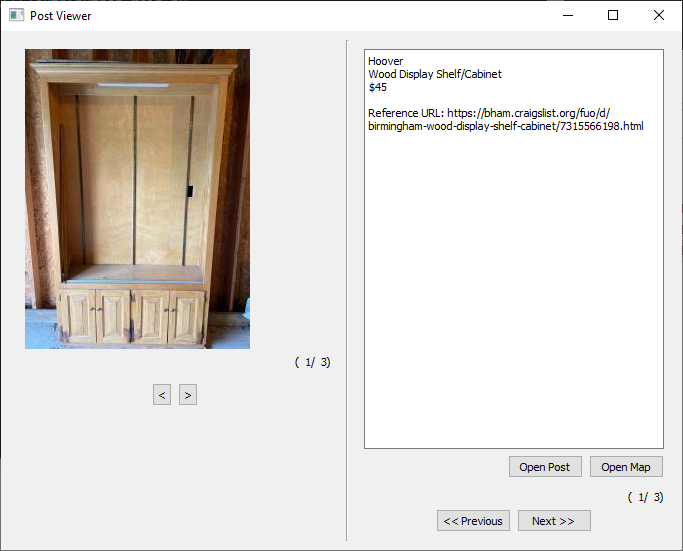

# CLAPI
A basic API to scrape Craigslist.

Most useful for viewing posts across a broad geographic area or for viewing posts within a specific timeframe.

<h2>Requirements:</h2>
<ul>
  <li>bs4 (BeautifulSoup)</li>
  <li>shutil</li>
  <li>requests</li>
  <li>datetime</li>
  <li>PyQt5</li>
  <li>subprocess</li>
</ul>

<strong>Note</strong>: All of these packages should be available from standard distributions, such as Anaconda.

<h2>Typical Use Case:</h2>
<pre>
<code>
from CLAPI import CraigsList
cities = []
for state in ['AL', 'AK', 'AZ', 'AR']:
    cities += CraigsList.GetCitiesByState(state)
hours = float(input('Posts in the last x hours >> '))/24
query = input('Query >> ')
for city in cities:
    print('Parsing %s...' % city)
    cl = CraigsList(city, query, CraigsList.SORT_RELEVANT, lookback=hours)
    posts += cl.posts
CraigsList.OpenViewer(posts, maxImgs=3)</code>
</pre>

The above example scrapes the posts during the lookback period for every city with a Craiglist in the specified states. These posts are presented to the user in a simple PyQt5 GUI for rapid browsing. The user can quickly open the associated post webpage or post location via buttons on the GUI.

<strong>Note</strong>: if you use a browser other than chrome, you will want to modify the subprocess call in the MainWindowHandlers.py file such that you call the appropriate browser.

Be aware, this program will create a temporary directory within your current working directory, called 'tmp' in which the Craigslist thumbnail images are downloaded. When the program exits without errors, this temporary directory will be deleted.

